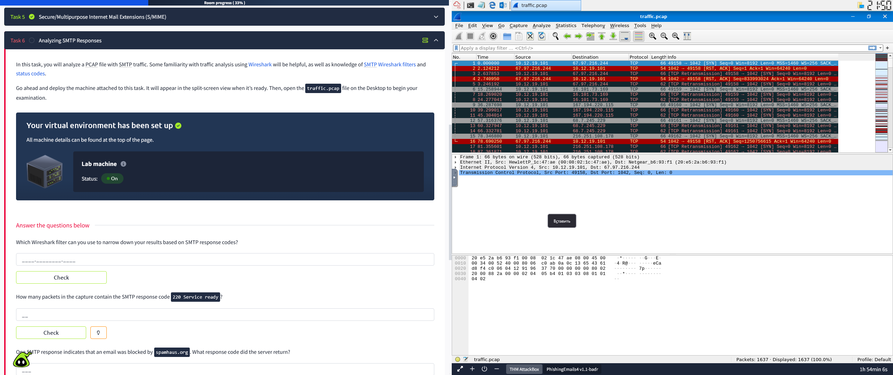
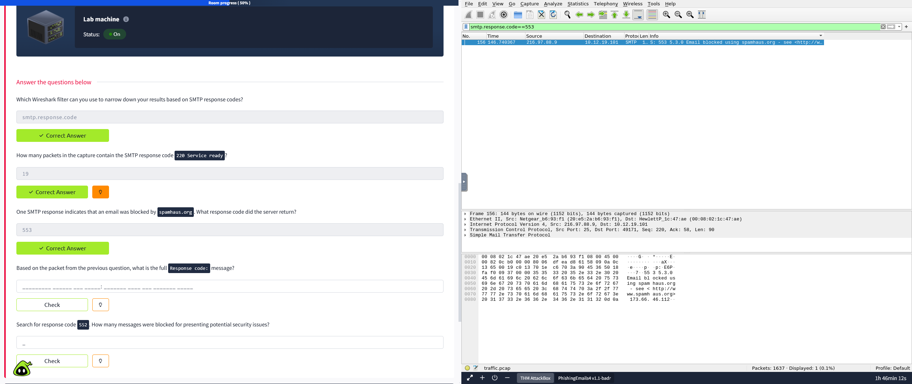
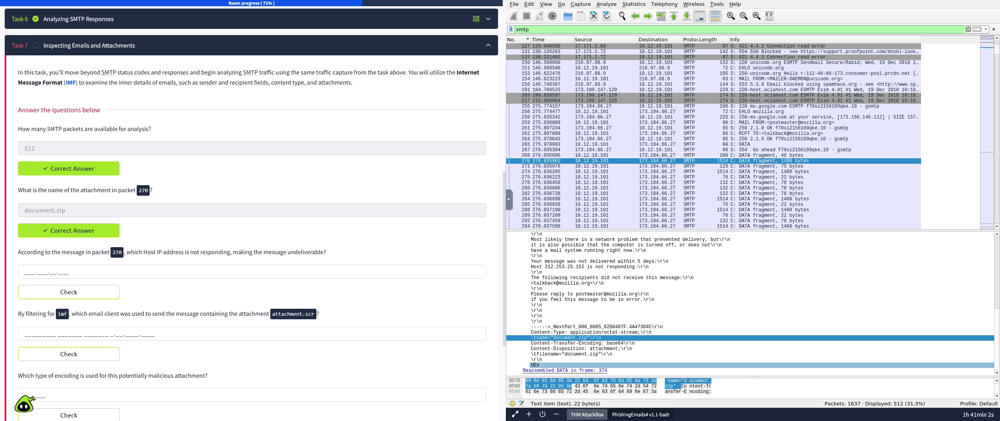
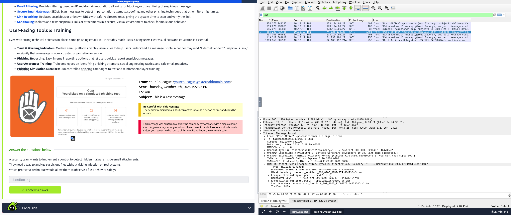

# 🦈 Wireshark PCAP Analysis: Phishing & SMTP Traffic

[](https://www.wireshark.org/)
[]()

This repository contains a hands-on network forensics laboratory focused on analyzing malicious email traffic (`.pcap`) using **Wireshark**. The primary objective is to investigate SMTP communications, extract indicators of compromise (IOCs) from phishing attempts, and understand email security mechanisms using the Internet Message Format (IMF).

---

## TASK 1: Analyzing SMTP Responses & Server Blocks

* **Objective:**
  Filter and analyze SMTP response codes to identify emails blocked by anti-spam services and locate potential security threats.

* **Process:**
  1. Applied the Wireshark filter specifically for SMTP response codes:
     ```wireshark
     smtp.response.code
     ```
  2. Searched for emails blocked by spam blacklists (e.g., `spamhaus.org`) by filtering for the specific `553` block code:
     ```wireshark
     smtp.response.code == 553
     ```
     *Found:* Investigating the packet details under the Simple Mail Transfer Protocol tree revealed the full server response.
  3. Filtered for response code `552` to identify messages blocked due to potential security issues (e.g., exceeded storage or malicious content):
     ```wireshark
     smtp.response.code == 552
     ```

* **Result:**
  * Identified the exact Wireshark filter for response codes: `smtp.response.code`.
  * Counted **19 packets** containing the `220 Service ready` code.
  * Discovered that the server returned code **`553`** for emails blocked by `spamhaus.org`.
  * Extracted the full message for the block: `Requested action not taken: mailbox name not allowed (553)`.
  * Found **6 messages** blocked due to potential security issues (code 552).

#### Evidence: SMTP Response Codes



---

## TASK 2: Inspecting Emails, Attachments, and IMF

* **Objective:**
  Examine the inner details of emails (sender, recipient, content type, attachments) using the Internet Message Format (IMF) protocol in Wireshark.

* **Process:**
  1. Filtered the PCAP for general SMTP traffic to see the available packets:
     ```wireshark
     smtp
     ```
  2. Analyzed packet `270` by inspecting the MIME Multipart Media Encapsulation layer to extract the filename of the attached payload.
  3. Inspected the text/plain encapsulated multipart data within packet `270` to read the bounce message indicating a delivery failure.
  4. Filtered the traffic for Internet Message Format (`imf`) to identify the specific email client (X-Mailer) used to send malicious payloads like `attachment.scr`:
     ```wireshark
     imf
     ```

* **Result:**
  * Identified **512 SMTP packets** available for analysis.
  * Extracted the attachment name in packet 270: **`document.zip`**.
  * Found that the Host IP **`212.253.25.152`** was not responding, causing the message to be undeliverable.
  * Extracted the attacker's email client signature from the IMF headers: **`Microsoft Outlook Express 6.00.2600.0000`**.

#### Evidence: Attachment & IMF Analysis



---

## TASK 3: Email Security & Anti-Phishing Controls

* **Objective:**
  Determine the correct protective technique to safely analyze suspicious files without risking infection on real enterprise systems.

* **Process & Result:**
  * To observe a file's behavior safely and detect hidden malware inside email attachments, the required security control is **Sandboxing**. It isolates and tests suspicious links or attachments in a secure, virtual environment.
